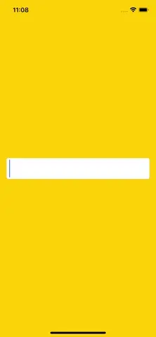

# WWEmojiTextField
[](https://developer.apple.com/swift/) [](https://developer.apple.com/swift/)  [](https://developer.apple.com/swift/) [](https://developer.apple.com/swift/)

### [Introduction - 簡介](https://swiftpackageindex.com/William-Weng)
- [A text field that simply converts input words into emoticons.]()
- [一個簡單把輸入單字轉成顏文字符號的文字框。](https://apifox.com/apiskills/sse-vs-websocket/)



### [Installation with Swift Package Manager](https://medium.com/彼得潘的-swift-ios-app-開發問題解答集/使用-spm-安裝第三方套件-xcode-11-新功能-2c4ffcf85b4b)
```bash
dependencies: [
    .package(url: "https://github.com/William-Weng/WWEmojiTextField.git", .upToNextMajor(from: "1.0.0"))
]
```

### [Function](https://ezgif.com/video-to-webp)
|函式|功能|
|-|-|
|configure(mapping:highlightColor:convertRegex:highlightRegex:)|初始設定|

### [WWEmojiTextField.Delegate](https://ezgif.com/video-to-webp)
|函式|功能|
|-|-|
|convert(textField:result:)|文字的轉換結果|
|highlight(textField:result:)|高亮的轉換結果|
|didChange(textField:)|文字變換的提示|

### Example
```swift
import UIKit
import WWEmojiTextField

final class ViewController: UIViewController {

    @IBOutlet weak var textField: WWEmojiTextField!

    private var emojiMapping: [String: String] = [:]

    override func viewDidLoad() {
        super.viewDidLoad()
        loadEmojiMapping()
        textField.configure(mapping: emojiMapping)
    }
}

private extension ViewController {
    
    func loadEmojiMapping() {

        guard let url = Bundle.main.url(forResource: "emojiMapping", withExtension: "json"),
              let data = try? Data(contentsOf: url),
              let decodedMap = try? JSONDecoder().decode([String: String].self, from: data)
        else {
            return
        }
        
        emojiMapping = Dictionary(uniqueKeysWithValues: decodedMap.map { ($0.lowercased(), $1) })
    }
}
```

